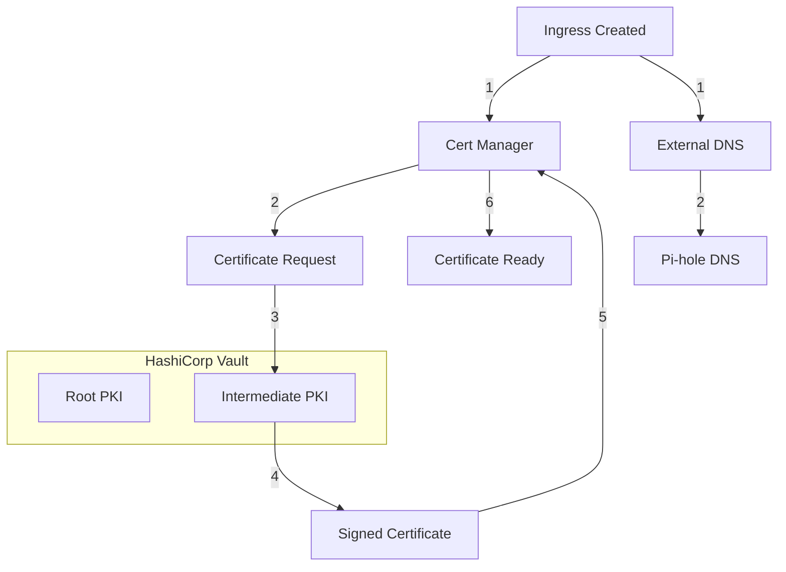

# home-ops 🏠🤖

My personal Kubernetes cluster orchestrated by [ArgoCD](https://argo-cd.readthedocs.io/en/stable/) and [Renovate](https://docs.renovatebot.com/) 

## Bootstrap

1. kubernetes/system/network/cilium
```bash
helm install cilium kubernetes/system/network/cilium -n kube-system
```
2. kubernetes/system/network/coredns
```bash
# Attention, in the first install, disable monitoring unless the monitore is already installed
helm install coredns kubernetes/system/network/coredns -n kube-system
```

## Local certificate and domain management

